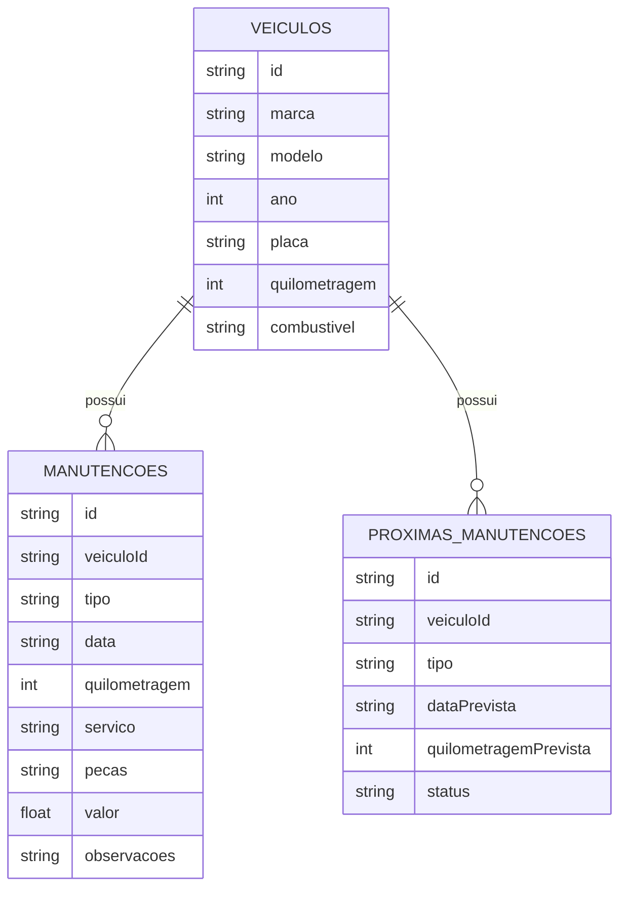

# 🛠️ Especificação Técnica (Tech Spec) - CarCare

Este documento detalha a arquitetura técnica, o modelo de dados e os contratos de API (via JSON Server) necessários para o funcionamento do sistema CarCare.

## 1. Modelo de Dados (Diagrama ER)

O Diagrama Entidade-Relacionamento (DER) representa a estrutura do banco de dados simulado (`db.json`) e como as informações do sistema se relacionam.

O CarCare possui três entidades principais:

* **Veículos:** Armazena as informações dos veículos cadastrados.
* **Manutenções:** Registra os serviços realizados nos veículos.
* **Próximas Manutenções:** Armazena os serviços que deverão ser realizados futuramente.



## 2. Dicionário de Dados

Breve explicação das entidades principais:

* **Veículos:** Responsável por armazenar os dados básicos dos veículos cadastrados.

  * `id`: Identificador único gerado pelo JSON Server.
  * `marca`: Marca do veículo.
  * `modelo`: Modelo do veículo.
  * `ano`: Ano de fabricação do veículo.
  * `placa`: Placa do veículo.
  * `quilometragem`: Quilometragem atual do veículo.
  * `combustivel`: Tipo de combustível utilizado pelo veículo.

* **Manutenções:** Registra o histórico de serviços realizados nos veículos.

  * `id`: Identificador único da manutenção.
  * `veiculoId`: Chave estrangeira que vincula a manutenção ao veículo.
  * `tipo`: Tipo da manutenção realizada, como troca de óleo, freios, pneus ou revisão.
  * `data`: Data em que a manutenção foi realizada.
  * `quilometragem`: Quilometragem do veículo no momento da manutenção.
  * `servico`: Descrição do serviço realizado.
  * `pecas`: Peças substituídas durante a manutenção.
  * `valor`: Valor total gasto na manutenção.
  * `observacoes`: Informações adicionais sobre o serviço.

* **Próximas Manutenções:** Armazena as manutenções programadas para o futuro.

  * `id`: Identificador único da manutenção futura.
  * `veiculoId`: Chave estrangeira que vincula a manutenção futura ao veículo.
  * `tipo`: Tipo de manutenção que deverá ser realizada.
  * `dataPrevista`: Data prevista para realização da manutenção.
  * `quilometragemPrevista`: Quilometragem prevista para realização da manutenção.
  * `status`: Situação da manutenção, podendo ser "EM_DIA", "PROXIMA" ou "ATRASADA".

### Regras de relacionamento

* Um **veículo** pode possuir várias **manutenções**.
* Um **veículo** pode possuir várias **próximas manutenções**.
* Cada **manutenção** pertence a apenas um veículo.
* Cada **próxima manutenção** pertence a apenas um veículo.

## 3. Rotas da API (JSON Server)

A aplicação utiliza uma API local simulada pelo JSON Server.

Abaixo estão os principais endpoints:

### Veículos

* `GET /veiculos` - Retorna a lista de veículos cadastrados.
* `GET /veiculos/:id` - Retorna um veículo específico.
* `POST /veiculos` - Cadastra um novo veículo.
* `PUT /veiculos/:id` - Atualiza os dados de um veículo.
* `DELETE /veiculos/:id` - Remove um veículo.

### Manutenções

* `GET /manutencoes` - Retorna todas as manutenções.
* `GET /manutencoes/:id` - Retorna uma manutenção específica.
* `GET /manutencoes?veiculoId=1` - Retorna as manutenções de um veículo específico.
* `POST /manutencoes` - Cadastra uma nova manutenção.
* `PUT /manutencoes/:id` - Atualiza uma manutenção.
* `DELETE /manutencoes/:id` - Remove uma manutenção.

### Próximas Manutenções

* `GET /proximasManutencoes` - Retorna todas as próximas manutenções.
* `GET /proximasManutencoes/:id` - Retorna uma próxima manutenção específica.
* `GET /proximasManutencoes?veiculoId=1` - Retorna as próximas manutenções de um veículo.
* `POST /proximasManutencoes` - Cadastra uma próxima manutenção.
* `PUT /proximasManutencoes/:id` - Atualiza uma próxima manutenção.
* `DELETE /proximasManutencoes/:id` - Remove uma próxima manutenção.

## 4. Estrutura do Banco de Dados (db.json)

Esta é a representação em formato JSON do banco de dados simulado. Essa estrutura servirá de contexto para ferramentas de IA e para o JSON Server inicializar a API Fake.

```json
{
  "veiculos": [
    {
      "id": "1",
      "marca": "Chevrolet",
      "modelo": "Onix",
      "ano": 2015,
      "placa": "ABC1D23",
      "quilometragem": 87420,
      "combustivel": "Flex"
    }
  ],
  "manutencoes": [
    {
      "id": "1",
      "veiculoId": "1",
      "tipo": "Troca de óleo",
      "data": "2026-08-10",
      "quilometragem": 85000,
      "servico": "Troca de óleo do motor",
      "pecas": "Óleo do motor e filtro de óleo",
      "valor": 280.00,
      "observacoes": "Próxima troca recomendada aos 95.000 km."
    }
  ],
  "proximasManutencoes": [
    {
      "id": "1",
      "veiculoId": "1",
      "tipo": "Troca de óleo",
      "dataPrevista": "2026-11-10",
      "quilometragemPrevista": 95000,
      "status": "PROXIMA"
    },
    {
      "id": "2",
      "veiculoId": "1",
      "tipo": "Revisão",
      "dataPrevista": "2027-02-10",
      "quilometragemPrevista": 100000,
      "status": "EM_DIA"
    }
  ]
}
```
